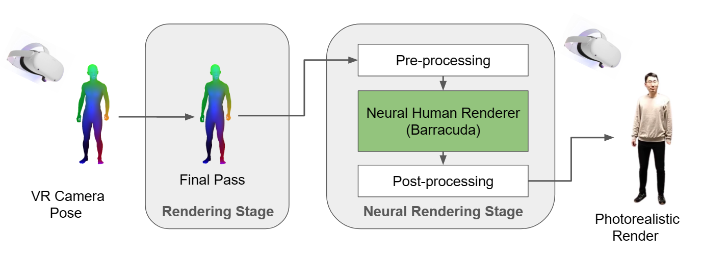
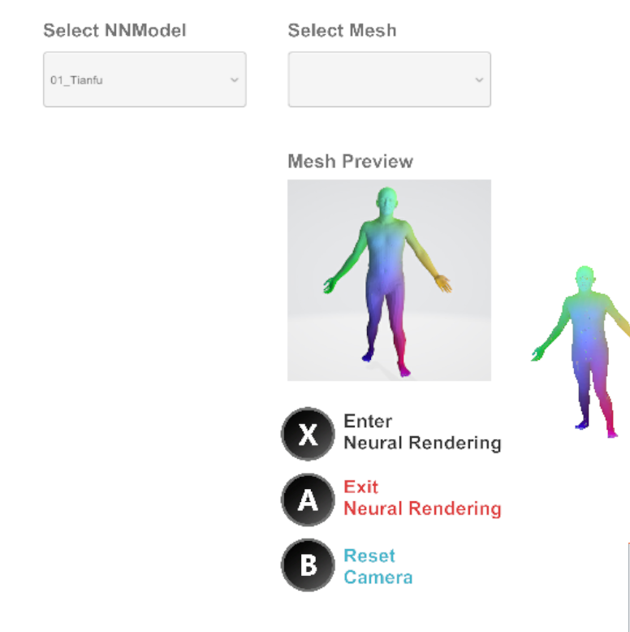

# Real-time Barracuda Neural Rendering for VR

In this repository, we develop a general neural rendering pipeline for VR devices that can display in real-time. The pipeline is built on the [Unity](https://unity.com/) engine and [Barracuda](https://github.com/Unity-Technologies/barracuda-release) package. This demo contains two applications for neural rendering: scene style transfer and photorealistic human rendering. The Unity demo can be downloaded [here](https://drive.google.com/file/d/1KeoINYymnIi4PJmP1ra5V68eZgXrKZ82/view?usp=sharing).

      

# Pipeline
- Given the real-time VR headset pose and scene mesh, we use the Unity multi-pass built-in renderer to obtain the raw rendered view from the current camera position and store it in the input texture. 
- In the neural rendering stage, we prepare a pre-trained neural rendering network in [ONNX](https://onnx.ai/) format and load it to the Barracuda. The input texture is firstly pre-processed with the cropping and down-sampling, then is passed to the neural network inference module for rendering. 
- Finally, the result is post-processed with the up-sampling and copied back to the output texture. 

      

# Control
We have tested the demo on the Oculus Quest 2.
- Left Thumbstick to control the position of the camera
- Right Thumbstick to change the view direction of the camera
- X to enable neural rendering
- A to disable neural rendering
- B to reset the camera to the original position

      

# Usage
1. Use trigger to select a neural rendering model (NNModel) (human rendering or scene transfer) from the left menu.
2. Use trigger to select a mesh for testing from the right menu. 
3. Click X to enable neural rendering. 
4. Use left/right Thumbstick to freely explore the scene! 
5. Click A to disable neural rendering and try other scenes.

More instructions can be found in this [demo video](https://drive.google.com/file/d/1kyHt-a0Jez78DYeuOTsv-oEHGvjLQuea/view).
